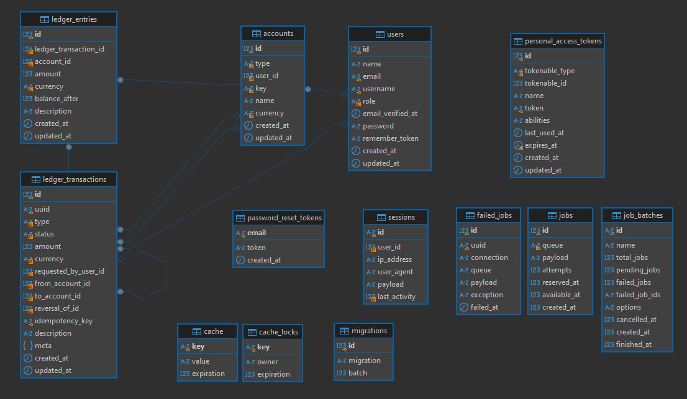

# Wallet Flow — Desafio (carteira financeira)

Aplicação de carteira financeira com **depósitos**, **transferências** e **rollback (reversal)**, usando **Ledger (double-entry)**, **RabbitMQ** (fila) e **Laravel Sanctum** (auth).

<p align="center">
  
</p>

<p align="center">
  
  
  
  
  
  
  
  
  
</p>

## 🧰 Tecnologias / Ferramentas

- **Backend**: Laravel 12.56.0 (PHP 8.2.12)
- **Frontend**: Vue 3.5.31 + Vite 6.4.1 + Tailwind 4.2.2
- **Banco de dados**: MySQL 8.4 (Docker)
- **Filas**: RabbitMQ 3 (management) + driver `vladimir-yuldashev/laravel-queue-rabbitmq` 14.4.0
- **Auth**: Laravel Sanctum 4.3.1 (Bearer token via `personal_access_tokens`)
- **Infra (dev)**: Docker Compose (containers: `mysql`, `rabbitmq`, `worker`)
- **UX**: SweetAlert2 11.12.4 (toasts de sucesso/erro)

## 🧠 Conceitos

- **Ledger (double-entry)**: toda operação gera **2 lançamentos** (`ledger_entries`) para manter auditoria e rastreabilidade.
- **Jobs/Queues**: `deposit`, `transfer` e `reversal` são criadas como `pending` e processadas por worker.
- **Transações de banco**: operações críticas usam `DB::transaction()` + locks quando necessário.
- **Idempotência (transferência)**: suporte via header `Idempotency-Key` (evita duplicidade).
- **SOLID / Clean Code (parcial)**: separação por controllers/jobs e validações explícitas (pode evoluir para Service/Repository/DTO).

## 🗄️ Database



- 🔐 **Auth / usuários**
    - `users`: usuários (admin/cliente)
    - `personal_access_tokens`: tokens do Sanctum (sessão via API)
    - `password_reset_tokens`: reset de senha (padrão Laravel)
    - `sessions`: sessões do Laravel (driver database; secundário no SPA com Bearer token)
- 💰 **Carteira (Ledger)**
    - `accounts`: contas BRL do usuário e conta `system` da plataforma
    - `ledger_transactions`: transações (deposit/transfer/reversal) com status (pending/posted/failed)
    - `ledger_entries`: lançamentos (double-entry) que formam o saldo
- 🐇 **Filas / jobs**
    - `jobs`, `failed_jobs`, `job_batches`: infraestrutura do Laravel Queue (útil p/ debug e se trocar driver)
- 🧊 **Cache / infra**
    - `cache`, `cache_locks`: cache e locks do Laravel (driver database)
- 🧾 **Controle interno**
    - `migrations`: histórico das migrations executadas

## 📜 Regras de negócio

### Saldo e Ledger

- O **saldo** do cliente é calculado pela soma de `ledger_entries.amount` (em centavos) da conta BRL.
- A aplicação não “edita saldo”: o saldo é consequência dos lançamentos do ledger.

### Depósitos (`deposit`)

- Valor deve ser **maior que zero**.
- Cria uma transação `ledger_transactions` com `status=pending` e enfileira o job para postar os lançamentos.

### Transferências (`transfer`)

- Valor deve ser **maior que zero**.
- Destinatário deve existir (cliente) e **não pode ser o próprio remetente**.
- **Saldo insuficiente** bloqueia a criação.
- Cria uma transação `pending` e enfileira o job para postar os lançamentos.
- Suporta **idempotência** via `Idempotency-Key`.

### Rollback (`reversal`)

- Rollback **não apaga** histórico: cria uma nova transação do tipo `reversal` apontando para `reversal_of_id`.
- Só permite rollback de transações `posted`.
- Não permite rollback se existir **transferência `pending`** envolvendo o usuário (evita inconsistências).
- Não permite rollback se a reversão deixaria o usuário com **saldo negativo**.
    - Exemplo: usuário depositou, transferiu todo o valor e tenta reverter o depósito → bloqueado.

## 🔐 Autenticação (Sanctum)

- `POST /api/login` retorna `token` + `user`.
- O frontend usa `Authorization: Bearer <token>` (persistido em `localStorage`).
- `POST /api/logout` revoga o token atual.

## 🚀 Execução (dev)

### Subir infraestrutura (MySQL/RabbitMQ/Worker)

```bash
docker compose up -d
```

- RabbitMQ UI: `http://127.0.0.1:15672` (default `guest` / `guest`)
- Fila configurada: `walletflow.transactions` (env `RABBITMQ_QUEUE`)

### App (local)

```bash
composer install
npm install

php artisan migrate --seed

npm run dev
php artisan serve
```

### Monitorar worker / fila

- RabbitMQ UI → `Queues and Streams` → `walletflow.transactions` → `Consumers` (deve ser > 0)
- Logs do worker: `docker compose logs -f worker`

### Rodar worker local (sem Docker)

```bash
php artisan rabbitmq:consume rabbitmq --queue=walletflow.transactions --sleep=1 --tries=3 --timeout=90 --name=local-worker
```

## 🧪 Testes

```bash
php artisan test
```
